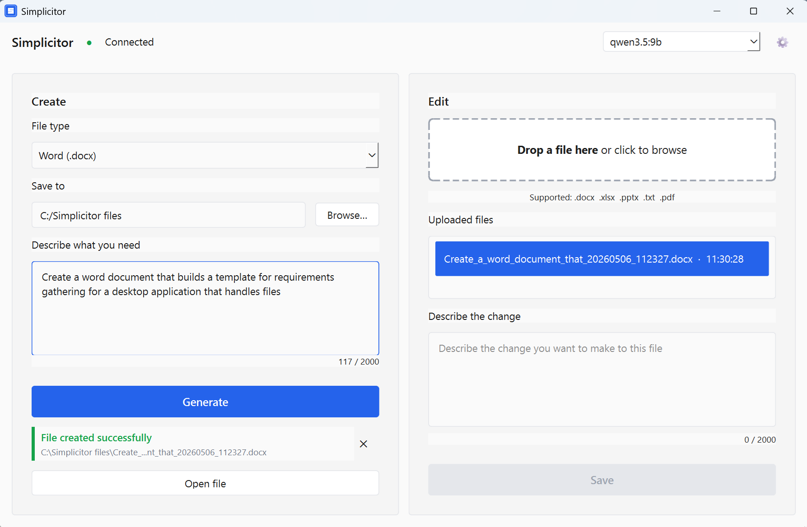

# Simplicitor

*Native Windows app that turns a local Ollama LLM into an Office document generator.*

[](LICENSE) [](https://github.com/alexnosx/Simplicitor/releases) []()

## What it is

Simplicitor generates and edits Word, Excel, and PowerPoint files from natural language prompts. You type what you want, select a file type, and the app talks to a locally running Ollama instance to produce the file. For existing documents, you drag a file in, describe the change, and Simplicitor applies it and saves a backup. PowerPoint decks can be generated from scratch or from a styled template (built-in or your own). Single `.exe`, no installation, no Python required, no cloud.

Simplicitor is not a chat interface. It is not a RAG tool. It is not a model manager or a general-purpose AI assistant. It does one thing: it turns a local LLM into a document production tool with a file output you can actually use.

## Why this exists

The local AI space is saturated with chat interfaces. Chat is the commodity. What is missing is the step after the conversation — the actual file, the deliverable, the thing a non-technical user can take somewhere. Simplicitor exists because the "I installed Ollama, now what?" gap is real and unaddressed. Users go through the effort of running a local model and then have nowhere productive to take it. This app closes that gap: pick a file type, describe what you need, get a file.

## Screenshot



## Install and run

### Download the binary

Download `Simplicitor.exe` from the [Releases](https://github.com/alexnosx/Simplicitor/releases) page. The binary is currently unsigned — Windows SmartScreen will show a warning on first run. To run it anyway: click **More info**, then **Run anyway**.

### Build from source

Requirements: Python 3.11+, Git.

```bat
git clone https://github.com/alexnosx/Simplicitor.git
cd Simplicitor
pip install -r requirements.txt
pip install -r requirements-build.txt
python resources/create_icon.py
python build.py
```

The build script (`build.py`) invokes Nuitka in onefile mode with the PySide6 plugin, bundles the prompt files and pptx template, and writes `dist\Simplicitor.exe`. Build time is 5–10 minutes on a modern machine.

## Requirements

- Windows 10 or 11 (64-bit)
- A running Ollama instance reachable at `localhost:11434`
- At least one model pulled (`ollama pull <model>`)
- Recommended: 7B+ parameter model for reliable structured output (4B works with degraded output quality on complex documents)

## Generate from a template (PowerPoint)

Added in v1.2. Instead of building slides from a blank canvas, you can hand Simplicitor a real PowerPoint design and have the LLM fill its layouts. The result keeps the template's branding, fonts, colors, and layout, so the deck looks like a designer made it rather than a script.

**How it works:**

1. In the Create panel, with PowerPoint selected, click **From template...** to open the picker.
2. Pick a template — either a built-in one or one you upload — and confirm the structure.
3. Type your prompt in the main Create field and click **Generate** as usual. The deck is rendered into the template's design.

**What ships:**

- **`business_pitch`** — a clean charts 16x9 template with title / agenda / content / closing slide types. Bullet lists on the agenda and content slides.
- **`technical_overview`** — a title / architecture / bullets layout set for engineering documentation.

Both seed on first launch into `Documents\Simplicitor\Templates` (the location is configurable in Settings). The folder is yours: delete a default to make Simplicitor restore it on next launch, or drop in your own templates and they appear in the picker.

**Uploading your own template:**

Click **Upload a .pptx...** in the picker. Simplicitor inspects the deck, scores its layouts, strips the sample content, and writes a draft manifest mapping each layout to a slide type. Decks built entirely from hand-placed text boxes (no real placeholders) are rejected with a clear explanation — the engine fills placeholders, not free-form shapes.

**What the LLM sees:**

Only the schema. Field names, slide-type names, max-character and max-item limits, and a single one-shot example assembled from the manifest. The LLM produces validated JSON keyed to the manifest's fields; Python renders it. If the model returns malformed JSON or content that fails schema validation, the pipeline runs one repair attempt and surfaces a clear error if that fails too.

## How it was built

Simplicitor was built PRD-first: a v1.0 PRD was written before any code, iterated to v1.2 against scope creep and architectural stress tests, then broken into six implementation phases. Claude Opus 4.6 was the strategic thinking partner for architecture and contract design; Claude Code handled all implementation across approximately 1.4 million tokens of generation. The human role was PM, architect, code reviewer, and tester — not coder. Not a single line of code was written by hand. See [BUILD_STORY.md](BUILD_STORY.md) for the full account.

## Architecture at a glance

- **LLM produces content and structure only** — Python handles all formatting, colors, and layout; this is what makes the app work reliably on 4B models
- **Templates fill placeholders, never repaint** — for PowerPoint, the LLM emits content keyed to a manifest's fields and Python renders it into a real `.pptx` design; the template's masters, layouts, and theme are the source of truth for styling
- **Scope detection on manipulation** — out-of-scope prompts (theme colors, visual styling) are detected and rejected before any file is touched; no silent failures
- **One-to-one backup logic** — first manipulation of a file creates a backup; subsequent manipulations of the same file do not; the backup always represents the original state
- **Model capability guidance, not gatekeeping** — sub-7B models show a non-blocking info banner; the app coaches users instead of blocking them
- **Nuitka over PyInstaller** — native C compilation produces a smaller binary (~30 MB) with dramatically fewer antivirus false positives
- **No cloud, no telemetry** — all communication is localhost Ollama only; log files record metadata (timestamps, file type, success/error) but never prompt text or file content

## License

Simplicitor is licensed under the [PolyForm Noncommercial License 1.0.0](LICENSE). You may read, fork, modify, and use it for personal and noncommercial purposes. You may not sell it, include it in a paid product, or use it as part of a commercial offering. See [LICENSE_NOTICE.md](LICENSE_NOTICE.md) for a plain-English summary.

## Contributing

Issues are welcome but not guaranteed to be addressed — this is a personal demonstration project with limited maintenance bandwidth. Pull requests are not currently accepted. Forks for personal use are encouraged under the license terms.

## Author

Built by [Alexandru Pop](https://www.linkedin.com/in/alexandru-pop-b29b73198/)
