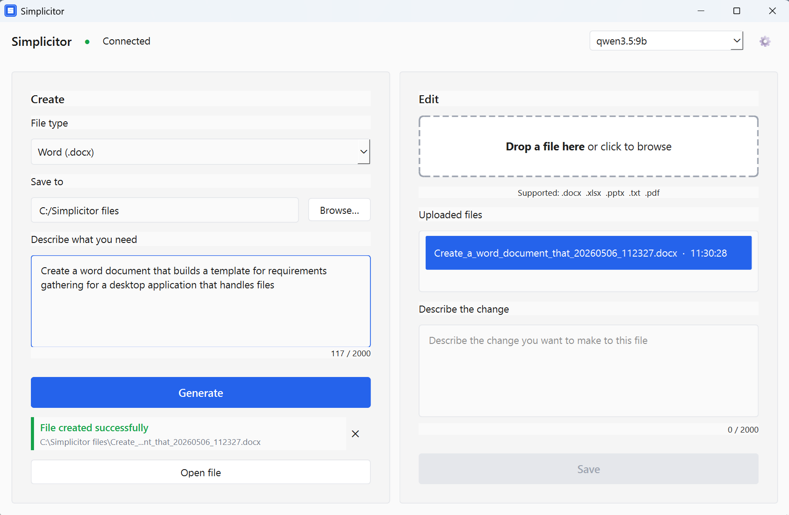

# Simplicitor

Windows desktop document work with local models.

## Project direction

[PRD.md](PRD.md) is the source for first-release scope, prerequisites, later milestones, and acceptance gates. [Project status](docs/PROJECT_STATUS.md) shows what exists and the decisions still open.

The review set is the [first-release architecture](docs/superpowers/specs/2026-10-08-document-architecture-design.md), [UI design](docs/superpowers/specs/2026-10-08-document-workspace-ui-design.md), and [single implementation plan](docs/superpowers/plans/2026-10-08-first-release-extraction.md). Build procedures are in [packaging](docs/code-signing.md). Historical screenshots and phase plans describe earlier versions.

## Screenshot



## Install and run

### Download the binary

Downloads are on the [Releases](https://github.com/alexnosx/Simplicitor/releases) page. Check [current build status](docs/PROJECT_STATUS.md#current-status) and [packaging and trust procedures](docs/code-signing.md) before distributing a build.

### Build from source

Requirements: Python 3.11+, Git.

```bat
git clone https://github.com/alexnosx/Simplicitor.git
cd Simplicitor
pip install -r requirements.txt
pip install -r requirements-build.txt
python resources/create_icon.py
python build.py
```

The build script (`build.py`) invokes Nuitka in onefile mode with the PySide6 plugin, bundles the prompt files, the default pptx template, and the built-in templates, and writes `dist\Simplicitor.exe`. Build duration depends on the compiler and machine; installer support is not yet configured in this script.

## Requirements

See [release prerequisites](PRD.md#workflow-scope) and the [model evaluation requirements](PRD.md#proposed-limits-and-evaluation-gates). For the existing application, start Ollama locally and pull a model with `ollama pull <model>`.

## Generate from a template (PowerPoint)

Added in v1.2. Instead of building slides from a blank canvas, you can hand Simplicitor a real PowerPoint design and have the LLM fill its layouts. The result keeps the template's branding, fonts, colors, and layout, so the deck looks like a designer made it rather than a script.

**How it works:**

1. In the Create panel, with PowerPoint selected, click **From template...** to open the picker.
2. Pick a template — either a built-in one or one you upload — and confirm the structure.
3. Type your prompt in the main Create field and click **Generate** as usual. The deck is rendered into the template's design.

**What ships:**

- **`business_pitch`** — a clean charts 16x9 template with title / agenda / content / closing slide types. Bullet lists on the agenda and content slides.
- **`technical_overview`** — a title / architecture / bullets layout set for engineering documentation.

Both seed on first launch into `Documents\Simplicitor\Templates` (the location is configurable in Settings). The folder is yours: delete a default to make Simplicitor restore it on next launch, or drop in your own templates and they appear in the picker. The template CLI (`python simplicitor/cli.py`) uses this same folder, so templates imported from either surface show up in both.

**Uploading your own template:**

Click **Upload a .pptx...** in the picker. Simplicitor scores the layouts and writes a draft manifest. Your deck needs a layout with a content placeholder beyond the title, or it is rejected: check Home > Layout or View > Slide Master for a body, content, or picture area. The result keeps the deck's theme and layouts; your slides are stripped.

**What the LLM sees:**

Only the schema. Field names, slide-type names, max-character and max-item limits, and a single one-shot example assembled from the manifest. The LLM produces validated JSON keyed to the manifest's fields; Python renders it. If the model returns malformed JSON or content that fails schema validation, the pipeline runs one repair attempt and surfaces a clear error if that fails too.

## How it was built

Simplicitor was built PRD-first: a v1.0 PRD was written before any code, iterated to v1.2 against scope creep and architectural stress tests, then broken into six implementation phases. Claude Opus 4.6 was the strategic thinking partner for architecture and contract design; Claude Code handled all implementation across approximately 1.4 million tokens of generation. The human role was PM, architect, code reviewer, and tester — not coder. Not a single line of code was written by hand. See [BUILD_STORY.md](BUILD_STORY.md) for the full account.

## Architecture at a glance

Use the [repository map](REPO_MAP.md) for existing module responsibilities, the [architecture design](docs/superpowers/specs/2026-10-08-document-architecture-design.md) for the proposed extraction components, and [project status](docs/PROJECT_STATUS.md) for implementation state and known defects.

## License

Simplicitor is licensed under the [PolyForm Noncommercial License 1.0.0](LICENSE). You may read, fork, modify, and use it for personal and noncommercial purposes. You may not sell it, include it in a paid product, or use it as part of a commercial offering. See [LICENSE_NOTICE.md](LICENSE_NOTICE.md) for a plain-English summary.

## Contributing

Issues are welcome but not guaranteed to be addressed — this is a personal demonstration project with limited maintenance bandwidth. Pull requests are not currently accepted. Forks for personal use are encouraged under the license terms.

## Author

Built by [Alexandru Pop](https://www.linkedin.com/in/alexandru-pop-b29b73198/)
