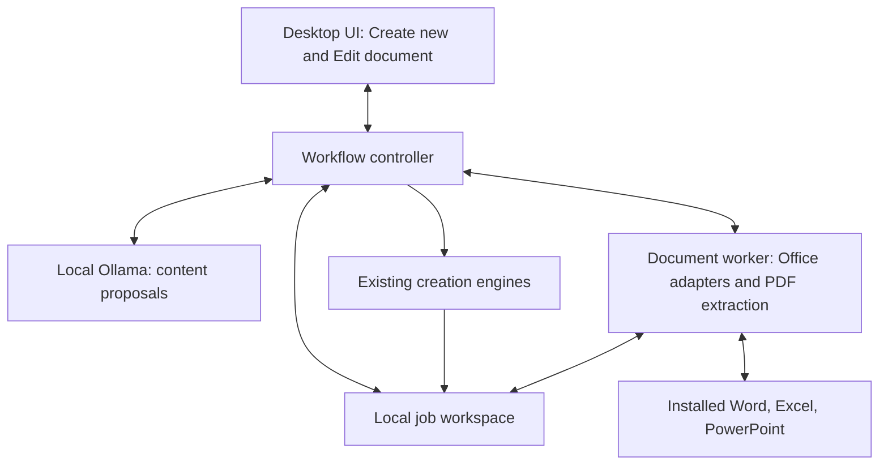

# Simplicitor document architecture proposal

Updated 2026-10-08. Draft for architectural review. The three workflows and installed desktop Office prerequisite are agreed requirements. The implementation structure below is a proposal, not implemented or integration-tested behavior. This document is not an execution plan.

## Product contract

Simplicitor makes local AI useful for confidential Office documents without scripts or agent configuration. Commercial viability means dependable behavior and usability here; no pricing model or license change has been selected. [PRD.md](../../../PRD.md) governs requirements; [project status](../../PROJECT_STATUS.md) records implementation evidence and decisions. The [UI proposal](2026-10-08-document-workspace-ui-design.md) describes the shared workspace.

| User action | Workflow |
|---|---|
| Create new, with a prompt | Generate a document from the instructions. |
| Create new, with a prompt and source files | Read the sources and create a new document using their information. |
| Edit document | Modify approved parts of an existing document. |

All workflows validate a separate saved candidate, show its preview, obtain approval for its exact version, and save a new output. Source files stay unchanged. The application has two main modes, Create new and Edit document. Word, Excel, and PowerPoint are the target output/editing families; PDF is also a read-only source for creation. Required source-based examples include XLSX-to-DOCX reporting and large DOCX/PDF-to-XLSX extraction. Supporting the workflows does not establish support for every input feature or conversion pair.

The first product requires installed desktop Word, Excel, and PowerPoint, local Ollama, and a usable local model. No Office or model installer is included. Source-based creation and shared review/publication are not implemented in v1.2; prompt-only generation exists.

## Proposed structure

Retain the existing Python/PySide6 application. Add small modules around one workflow controller and a document worker with Office adapters and PDF extraction, using existing generation engines. One document operation runs at a time. Local folders and JSON metadata are sufficient initially.

| Component | Responsibility |
|---|---|
| Desktop UI | Collect the request, output type, optional sources, and edit selection; show evidence, comparisons, previews, errors, and approval. |
| Workflow controller | Own job state, source identities, selection, analysis scope, validation, candidate identity, approval, and publication. |
| Ollama client | Propose text or typed replacements using explicit input and context; never execute document operations or arbitrary code. |
| Document integration | Use Office adapters for supported Office content, edits, calculation, and previews; use a read-only PDF extractor and a local OCR/vision path where required. |
| Local workspace | Store source snapshots, analysis evidence, candidates, previews, and job metadata with unique identities and explicit retention. |

Implement source extraction and supported numerical operations as functions behind the document integration and controller, not another general-purpose service. Separate read-only sources from writable candidate paths in their interfaces. Adding PDF sources does not add PDF write-back or another main UI mode. No agent harness, additional HTTP service, persistent document index, or database is needed for these workflows.

## Workflow and authority

The controller follows inspect, prepare, propose, validate, build candidate, review, and publish. Preparation differs by workflow: prompt-only creation has no source; source-based creation prepares evidence; editing prepares exact allowed targets. Existing output generators produce candidates, not final user outputs.

The model supplies content rather than file permissions. Editing responses name allowed target IDs and typed replacement values. Code checks target membership, expected original values, types, and source snapshot identity. Unknown, ambiguous, stale, or unsupported targets fail before publication. Relevant context can be read without becoming editable. Empty or malformed model responses cannot erase a document.

Keep source snapshots immutable. Approval binds the candidate's identity and hash, its preview, source snapshots, and the request. A revised request, selection, source, analysis scope, or candidate invalidates approval and requires another review. Publication copies the reviewed candidate to a new destination without source overwrites or output collisions. A write failure must not publish a partial result or report success.

The first editing slice remains supported DOCX/PPTX text replacements and XLSX literal cell values. Formula definitions, structural changes, chart edits, and layout redesign are outside that slice. Expected dependent calculation results and Word pagination can change; these consequences must be defined and visible rather than treated as permission to alter unrelated content.

## Creation from source files

Create new shows Describe your document, Output type, and Source files (optional). Attachments are read-only evidence sources, not editing targets. The application inspects their structure and confirms relevant scope when necessary, then prepares typed information for the model and output generator.

The required example is an accounting XLSX used to create a DOCX report:

1. Snapshot the workbook and inspect sheets, tables, types, formulas, and available periods.
2. Resolve material ambiguity about reporting scope, currencies, units, or missing inputs. Do not infer unavailable business facts.
3. Extract the relevant records locally. Preserve identifiers such as `00123` as text and distinguish missing values from zero.
4. Compute supported measures deterministically with code or Excel. If recalculation is required, use a disposable analysis copy and retain its relationship to the original snapshot; never save calculation changes into the supplied source.
5. Build numerical evidence with source IDs, worksheet/range references, scope, units, and reproducible calculation descriptions. Distinguish raw values, formulas, cached results, and newly calculated results. Stale or unsupported results must remain visible.
6. Ask the local model to explain and organize the evidence. Reuse the Word generator to build the candidate, with source references for reported figures. Prefer readable source labels to absolute local paths in the report.
7. Validate supported numerical facts and references against that evidence and show it alongside the saved Word preview. Narrative accuracy still requires review; valid JSON or valid references alone do not prove every claim true.
8. Approve the exact candidate and save a new Word file. Verify the supplied workbook remains unchanged.

Large workbooks need bounded source processing, not wholesale submission to the model. Deterministic aggregation can cover many rows while only the relevant evidence enters the prompt. Confirm scope and coverage, avoid double-counting detail and subtotal rows, and expose omissions or limitations. If sufficient evidence cannot fit or be produced safely, narrow the task or return an actionable limitation. Never silently truncate relevant source records and present the report as complete.

Multiple attached files are read-only inputs to one output job, not a batch of independent document operations. Supporting source-based creation does not authorize executing model-generated scripts, VBA, arbitrary formulas, or persistent indexing. Define supported source formats, calculation operations, and input/output combinations before release claims.

## Word and PDF extraction into Excel

This is the reverse source-based creation case: a large DOCX or PDF supplies records for a new XLSX. It uses the same controller, candidate review, and approval, with the existing Excel generator after type-preservation fixes. It is not restricted to copying already tabular data; narrative passages can contain the requested fields.

1. Snapshot the source and establish the selected scope. Confirm output columns, types, required fields, and the unit of a record when the prompt leaves them ambiguous. For example, one row might represent a contract or invoice rather than a page.
2. Read DOCX paragraphs and tables through the Office adapter. Read original PDF text, tables, and page coordinates through the PDF extractor. Retain source structure and references rather than flattening everything into one truncated string.
3. For PDFs, inspect text quality and image content per page/region. Use reliable existing text layers first; an image does not by itself require rerunning OCR. Unreadable or incomplete text layers in scanned or mixed content require a local OCR/local vision path or a visible unsupported-content result.
4. Process bounded sections with stable source anchors and explicit coverage tracking. Reconcile records spanning sections or pages, continuation tables, and repeated headers. Overlapping sections must not create duplicate rows, and legitimate repeated records must not be silently merged.
5. Let the local model propose field mappings and candidate records grounded in the source. Code validates types, required fields, source references, record associations, and supported consistency checks. Preserve raw evidence beside normalized values when interpreting dates, decimal separators, currencies, or identifiers. Missing and uncertain values require visible review, not invented replacements.
6. Build an XLSX candidate with typed literal cells and readable columns. Keep extracted text literal even when it resembles an Excel formula or link. Do not execute instructions embedded in the source document or model response. Retain record and relevant field provenance using DOCX paragraph/table references or PDF pages/regions and source snapshot IDs.
7. Review the saved workbook grid alongside the supporting source text/page preview. Expose uncertain records, errors, and coverage so a partial extraction cannot appear complete. Revisions invalidate approval. Save a new output only after approval; the supplied source remains unchanged.

Reuse the existing `pdfplumber` dependency for text/table extraction where suitable. Its [official documentation](https://github.com/jsvine/pdfplumber#comparison-to-other-libraries) states that it does not provide OCR; scanned-table extraction requires separate evaluation. The current legacy `_extract_pdf` only joins page text and truncates it, so reusing the dependency does not mean reusing that lossy workflow or claiming structured extraction exists.

Local OCR/vision selection, languages, image rendering, recognition quality, and packaging remain implementation decisions. No new dependency is installed by this proposal. A sensible delivery order is DOCX and PDFs with usable text first, then scanned/mixed sources after local recognition is validated. Detect unsupported content from the outset; do not advertise scanned-PDF coverage before that path passes acceptance. The requested PDF source workflow remains part of the design.

## Editing and preview through Office

Use three small adapters for Word, Excel, and PowerPoint. Native Office handling reduces the need to reproduce Office features, but does not prove preservation. Define support envelopes and compare relevant content, formulas, styles, relationships, and assets before and after. Reject unsupported features or changes rather than reconstructing files from plain text.

Use structured paragraph/span, cell-grid, and slide-text selectors for exact targeting. Export the saved candidate through Office to a local PDF and display it using Qt PDF. Excel also needs a saved-value/formula grid because print areas may omit cells. A PDF preview alone is not a workbook completeness check.

Run blocking Office calls in a helper process in the signed-in user's interactive desktop session, with a small message protocol. Keep current background-worker patterns for model requests. The helper is a responsiveness and recovery boundary, not a security sandbox or Windows service. It must own only Simplicitor's documents and must not terminate user-owned Office processes. Prove safe coexistence on supported Office versions, particularly PowerPoint; require PowerPoint to be closed if safe isolation cannot be established initially.

## Reuse and migration

| Existing asset | Treatment |
|---|---|
| PySide6 controls, styling, signals, settings | Retain useful parts and introduce the shared workspace and controller. |
| Ollama client and discovery | Retain with local-model checks, response validation, explicit context limits, and sanitized errors. |
| Word, Excel, and PowerPoint generators | Retain for Create; write candidates and fix type-preservation and validation defects. |
| PowerPoint template engine | Retain manifests, validation, repair, and rendering; route output through common review/publication. |
| Existing PDF dependencies | Reuse suitable text/table parsing capabilities behind a source adapter; replace truncating extraction and add explicit coverage and OCR handling. |
| Tests and synthetic fixtures | Retain meaningful regression coverage and add actual Office preservation and source-reporting checks. |
| Nuitka build and GitHub workflow | Adapt to the approved standalone/NSIS/portable route and test outside a development checkout. |
| Legacy whole-file reconstruction and basename-only working copies/backups | Retire from the new workflow after replacement and migration; preserve existing user files and backups. |

The template renderer imports `ManipulationError` from the legacy manipulator. Decouple that exception before deleting the module. Existing generators also need targeted fixes, including Excel coercion of text identifiers, unsafe or unsupported generated formulas, content-bearing error paths, and publication that bypasses review. Avoid unrelated package/import reorganizations.

## Privacy and operations

Use a local application-data workspace with distinct job IDs, a deliberate retention policy, and sanitized diagnostics. Do not identify sources only by basename. Keep prompts, contents, model output, identifiers, and sensitive paths out of logs. Working copies and previews are confidential data too.

Require genuine local inference; loopback transport alone is insufficient when Ollama cloud models are available. Document and verify local-only configuration. Preflight unsupported active/protected features, macros, external data retrieval, and link refresh before Office processing. Do not weaken global Office security or silently remove protection. Office connected services and synchronized source/output folders remain separate privacy boundaries requiring a tested supported configuration.

Keep the approved free distribution route in [packaging](../../code-signing.md). An unsigned installer does not resolve the reported Windows block by itself. The existing Noncommercial license also needs a separate business-use decision before a business pilot. This proposal changes neither licensing nor release publication authorization.

## Review questions and delivery gates

Before implementation, review Office ownership/coexistence, exact supported text/cell features, source-ingestion combinations, numerical evidence checks, calculation rules, extraction schemas and provenance, local OCR/vision, preview fidelity, candidate publication, retention, cancellation, and tested Windows/Office/model configurations. These are material subsystem decisions, not permission to fill gaps with broad preservation claims.

Proposed sequence: prove exact replacement, unchanged sources, reopening, PDF export, ownership, and failure recovery on synthetic files in all three Office formats; complete a Word editing workflow; add Excel and PowerPoint using the same controller; connect both Create paths, including XLSX-to-DOCX reporting and large DOCX/text-PDF-to-XLSX extraction; validate local OCR/vision for scanned and mixed PDFs before claiming that coverage; then verify clean installation and a small nontechnical-user pilot. This sequencing is not an implementation plan.

Acceptance must include prompt-only creation, source-based reporting with deterministic and traceable figures, DOCX/PDF-to-XLSX extraction, and selected-only editing. Extraction fixtures must cover narrative fields, tables, multipage records, repeated headers, chunk boundaries, leading-zero identifiers, locale-dependent dates/numbers, unreadable or contradictory fields, mixed/scanned PDFs, and literal strings that resemble formulas. Check source/output collisions, stale sources, malformed responses, unsupported or ambiguous inputs, oversized sources, missing data, stale calculations, Office prompts/timeouts, cancellation, and write failure. Fixtures should prove complete declared coverage and unchanged sources. A proposed usability target is four of five pilot users completing a supported first task without developer assistance. Measure latency on declared hardware/model configurations.

No Office automation, preview, preservation, or source-analysis integration has been tested in this proposal work. `pywin32` is a proposed new COM dependency, not installed or added to requirements. Qt PDF modules exist in the review environment; availability does not establish packaged behavior. Application code, declared dependencies, build scripts, and license are unchanged.

## Official references

Checked during architecture research on 2026-10-08:

- [Office desktop versus server automation](https://support.microsoft.com/en-us/visio/considerations-for-server-side-automation-of-office).
- [Office instance behavior](https://learn.microsoft.com/en-us/previous-versions/office/troubleshoot/office-developer/use-visual-c-automate-run-program-instance). This is older documentation; current supported Office versions require direct testing.
- PDF export in [Word](https://learn.microsoft.com/en-us/office/vba/api/word.document.exportasfixedformat), [Excel](https://learn.microsoft.com/en-us/office/vba/api/excel.workbook.exportasfixedformat), and [PowerPoint](https://learn.microsoft.com/en-us/office/vba/api/powerpoint.presentation.exportasfixedformat).
- [Qt PDF view](https://doc.qt.io/qtforpython-6/PySide6/QtPdfWidgets/QPdfView.html) and [Qt PDF licensing](https://doc.qt.io/qt-6.11/qtpdf-licensing.html).
- [Ollama local-only configuration](https://docs.ollama.com/faq#how-do-i-disable-ollama-cloud-features).
- [pywin32 COM support](https://github.com/mhammond/pywin32).
- [pdfplumber text/table capabilities and OCR limits](https://github.com/jsvine/pdfplumber#comparison-to-other-libraries), checked 2026-10-08.
